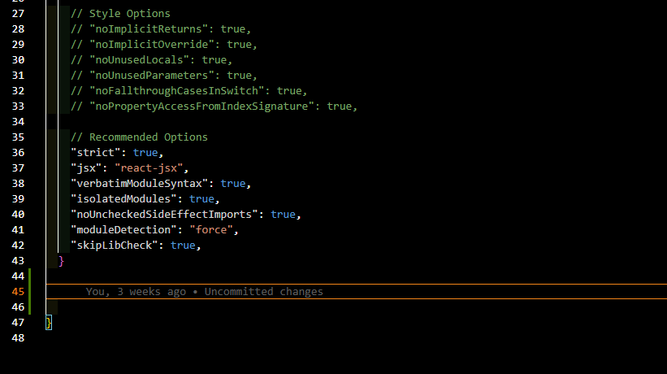

# Funciones del archivo TsConfig.

Cuando lo descargamos el archivo vien con una configuracion recomendada por defecto y podemos añadirle mas funcionalidades a parte por fuera del compilerOptions, donde se pueden añadir el include y el exclude.

Bueno ahora vamos a ir a la documentacion oficial y en la parte de Compiler Options.

[Opciones del Compilador Oficial](https://www.typescriptlang.org/tsconfig/)

En este apartado tendremos varios apartados y estan relacionadas al chequeo de tipos . Modulos - Emiciones - Soporte de Js - Soporte del editor - etc.

## Depuracion del codigo Ts.

Para saber por en que parte del codigo de ts estoy trabajando ya que como en la ewb solamente se estará usando Js entonces no me mostrara en que linea de ts hay un erro o estara imprimiendo para ello debemos a ir a el archivo de tsConfig y seguir los siguientes pasos.

buscar la linea donde esta el siguiente codigo:

    "sourceMap": true,  

Dejarla descomentada o en true 

Lo que es un MapFile y su terminacion es en .map y este documento es como un mapa a nuestro propio codigo ts para que cuando corramos en archivo Js que esta transpirado también nos muestre los mensajes de Ts especificandonos en que lineas estan estos mensajes o lo que sea

El archivo source map le dice a Js como esta escrito nuestro archivo y esto es muy bueno para corregir errores o depurar y tambien a analizar demasiado el codigo que estoy construyendo con su paso a paso.

## Remover comentarios.

Cuando hacemos la transpilacion a Js tambien se pasan los comentarios que hagamos en Ts y esto nos consume un poco más de recursos, para ello entonces debemos de modificar una linea de codigo del archivo de configuracion.

    "removeComments": True,

Una vez descomentada esta linea y guardados los cambios entonces los comentarios se borraran automaticamente al transpilar el codigo que creemos.

## Incluir o Excluir Carpetas.

### Excluir:

Para realizar esta personalizacion de excluir o incluir carpetas lo haremos despues de la configuracion de nuesto tsconfig

Ya ubicados tendremos que poner una coma al final despues de cerrar el array de configuraciones y ahi si escribiremos nuestro exclude donde excluiremos a todos los archivos que no queremos transpilar de forma automatica.

    },

    "exclude": [
        "node_modules",
        "dist"
    ]

Aqui tenemos como ejemplo los modulos de noude que normalmente estan excluidos de forma automatica.

### Incluir:

Para incluir archivos de forma manual o que querramos configurar para hacerse de forma automatica, entonces realizaremos los respectivos includes de la misma forma:

    ],

    "include": [
        "node_modules2"
    ]

Aqui estamos diciendo que incluya este archivo.

En el include se incluiran los archivos y directorios que se quieren usar entonces hay que escribir demasiado para ponerlos en el main

## Archivos de Salida.

Entonces el fin o a lo que queremos llegar es juntar todos los archivos de Js en una sola carpeta ya que al tener todos los archivos juntos es muy dificil de leer y mantener (archivos .ts - .map - .js).

Y tratar que nuestro arcchivo de Ts se resuma en uno solo para que asi solamente se cree una archivo de Js.

Entonces buscaremos en el archivo de configuracion la parte especifica para configurar el directorio de salida y el nombre del archivo en donde yo quiero el producto o la transpilacion completa.

    realizaremos los siguientes cambios al archivo:

    "outFile": "./main.js",
    
    "module": "amd",
    "target": "es5",

    Ahora revisaremos nuestro archivo main.js

Listo una vez hechos estos cambios entonces ahora si podremos ver que en nuestro archivo main esta conteniendo todos nuestro archivos en uno solo y para ello ya podremos borrar todos los archivos de relleno creados anteriormente

Si no hay archivos dentro o con error puede ser que no tengan su funcion anonima y bueno entonces ahora iriamos a el app.js e ingresaremos una funcion anonima autoinvocada como ya sabemos hacerlo y poner todo el codigo del archivo dentro de esta.

Porque este es nuestro fin tener solamente archivos de Ts y nomas uno de js y map. 

Al unificarlo todo en uno gracias a el archivo .map podremos encontrar donde esta cada cosas del arvhico .ts y cual de todos pertenece