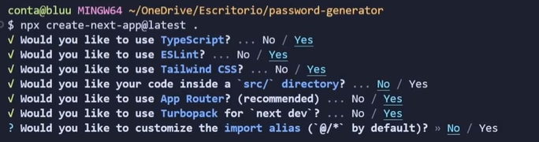

# Creacion del proyecto paso a paso.

Primero iremos a la url de next.js y luego a el apartado de instalacion ( https://nextjs.org/docs/app/getting-started/installation ).

luego en la carpeta donde queremos almacenar nuestro proyecto abrimos visual studio y en la terminal ejecutamos el siguiente comando:

    npx create-next-app@latest 

Y personalizaremos con las siguientes opciones:

Ahora haremos la configuracion con prisma por lo que nos dirigiremos a su web ( https://www.prisma.io/docs/guides/nextjs ).

