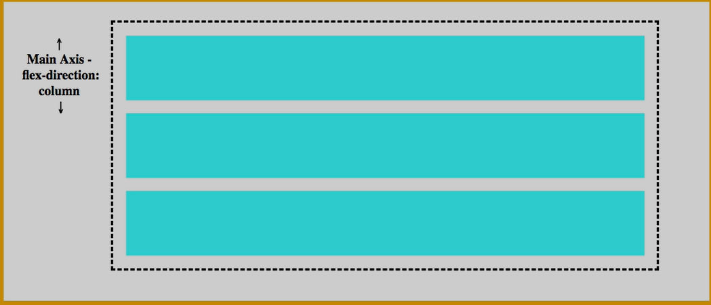

# Flexbox


`display`

**Definición técnica:** Define el tipo de caja de renderizado que genera el elemento (block, inline, flex, grid, etc.).

**Explicación simple:** Controla cómo se comporta el elemento en la página (como bloque o en línea).

**Ejemplo:**
```css
.bloque {
  display: block; /* Ocupa todo el ancho */
}

.en-linea {
  display: inline; /* Solo ocupa lo necesario */
}

.flex-container {
  display: flex;
}
```

Flexbox es un modelo unidimensional para crear y organizar los diseños, esto no añade animaciones ni textos ya que esta tecnologia, solamente para los layouts.

Al usar "display: flex;" habilitamos todas las opciones que nos dá flexbox, las cuales nos ayudan bastante para organizar nuestro contenido en dos ejes donde podemos ubicar o distribuir elementos:

En filas de izquierda a derecha, o en columnas de arriba hacia abajo.

row: se usa por default al definir el display flex.
row-reverse // column // column-reverse.

Al usar row / row-reverse : los elementos hijos se colocaran de izquierda a derecha uno junto al otro.


Al usar column / column-reverse: Los elementos se organizaran en columnas, de abajo hacia arriba o al reves.




Esta herramienta de flexbox nos ayuda mucho a alinear nuestros estilos y diseños, tenemos otras herramientas que se activan al usar fllexbox.

  justify-content: Se encarga de organizar el contenido en el eje horizontal
  align-items: 

