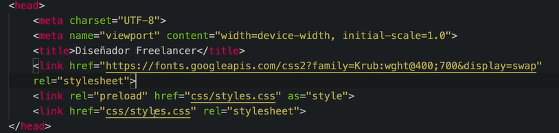

### Personalización de Fuentes de Texto

Tengamos en cuenta que todos los atibutos cuyo inicio sea "font-" tendran que ver con la modificacion de la fuente a la parte que estemos especificando.

Despues del - adjuntaremos que parte de la fuente queremos modificar ya sea: el tipo tipo de fuente, su grosor, su color, su tamaño y demás.

Podemos utilizar una herramienta de google para el diseño de las fuentes que usaras en paginas web, se llama google fonts.

vamos a utilizar una que nos guste, y copiaremos el link para usarla en nuestro html en el apartado de head:

<link rel="preconnect" href="https://fonts.googleapis.com">
<link rel="preconnect" href="https://fonts.gstatic.com" crossorigin>
<link href="https://fonts.googleapis.com/css2?family=Sixtyfour+Convergence&display=swap" rel="stylesheet">

Es muy importante tener en cuenta el orden con que declaras tus estilos ya que el contenido del head debe tener su orden ya que la especificidad es muy importante y dabes tener en cuenta todo lo que vamos a usar por lo que debemos ordearlo de forma correcta teniendo en cuenta unas reglas:

Por ejemplo la librerias siempre deben de ir primero, si vamos a usar una fuente diferente como en este caso, entonces la cargamos antes de cargar nuestros estilos ya que la usaremos en los estilos mas adelante, por lo que primero se agrega el enlace y luego se usa la fuente.

