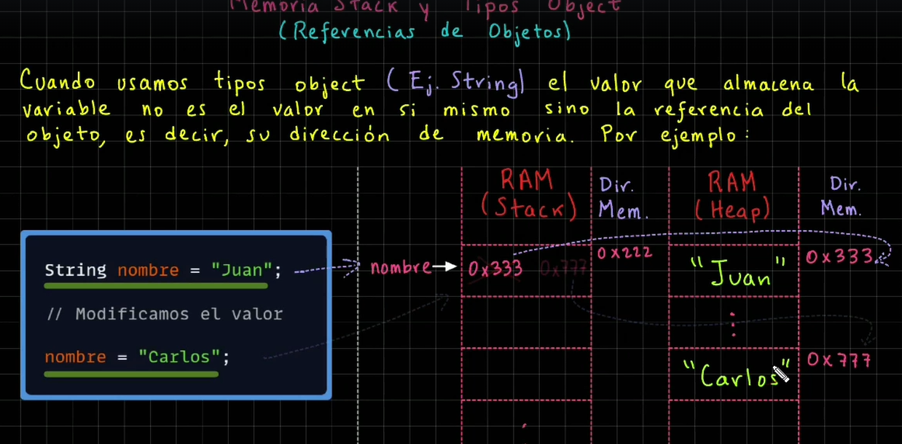

# VARIABLES.

Las variables son contenedores los cuales son capaces de almacenar datos, estos datos pueden cambiar con el paso del codigo, pero en java solo será un tipo de dato en especifico:

### Tipos de datos.

* Datos primitivos:

Estos son tipos de datos simples y básicos como:

Enteros: byte - short - int - long
Punto flotante: float - double
Caracter: char
Booleano: true - false

* Tipos de datos object (Referencian a objetos):

Cadenas 
Arreglos
Objetos o clases

### SINTAXIS

Para definir las variables primero se debe definir el tip de datos que vamos a almacenar, despues el nombre que tnedrá la variable, despues un = y finalmente el valor que vamos a almacenar:

    //variables
        int Edad = 19;
        double precio = 5000.05;
        boolean Disponible = true;
        char genero;
        
        // Modificar valor
        genero = 'M';
        Edad = 20;
        
        //Acceder
        
        System.out.println(genero);

### Uso de memoria.

    RAM (stack)
Para todos los datos primitivos como los anteriores mostrados, el funcionamiento es básico ya que estos valores son guardados en un espacio de la memoria ram, lo que guarda cada variable es el lugar exacto donde esta el valor que esta ubicado en la memoria ram

    RAM (Heap)
Pero para los objetos es muy diferente o strings ya que:

1) se crea el objeto "juan" en una posicion de la memoria "0x333"
2) Esta posicion "0x333" de la memoria es almacenada por la variable "nombre"
3) Cuando queramos acceder al valor del objeto "nombre" entonces se accede a la dirección en memoria "0x333"
4) finalmente esta nos llevara a donde tiene el objeto "juan" por lo tanto solo se guarda una referencia.

